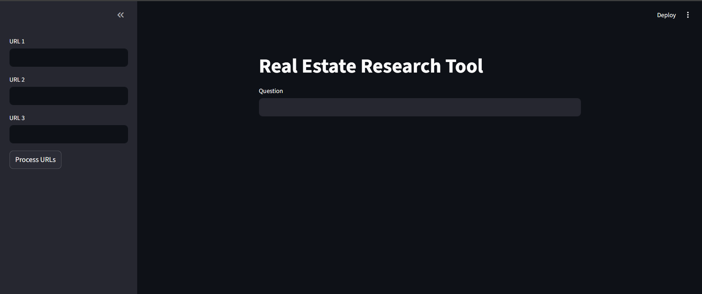
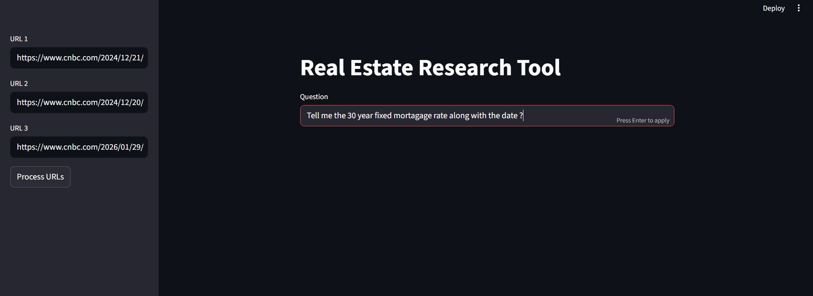
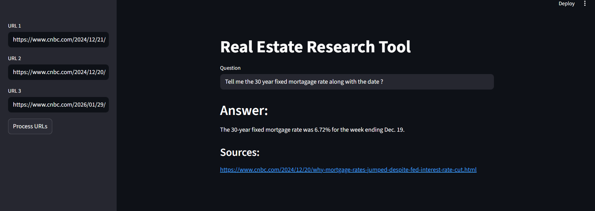

## Problem Statement

Users struggle to extract insights from long financial articles.

## Solution

Built a RAG-based system that:
- Extracts article content
- Stores embeddings
- Answers queries using LLM

# Real Estate Research Tool (RAG + LLM)

We are building a **user-friendly real estate research tool** that allows users to extract insights from financial articles and mortgage-related news using AI.

---

##  Product Screenshot

###  Full View


###  Input View


###  Output Screen


---

## Features

* Load URLs or upload text files containing article links
* Extract article content using **Playwright URL Loader**
* Split and process text using **LangChain Text Splitter**
* Generate embeddings using **HuggingFace models**
* Store and retrieve data using **ChromaDB (Vector Database)**
* Ask questions and get answers using **LLM (Groq - LLaMA 3)**
* Display answers along with **source URLs**

---

## Tech Stack

* Python
* LangChain
* ChromaDB
* HuggingFace Embeddings (`BAAI/bge-small-en-v1.5`)
* Groq LLM (`llama-3.3-70b-versatile`)
* Playwright
* Streamlit

---

## Setup Instructions

### 1. Install dependencies

```bash
pip install -r requirements.txt
```

---

### 2️. Install Playwright browsers

```bash
playwright install
```

---

### 3️. Create `.env` file

```text
GROQ_API_KEY=your_api_key_here
```

---

## ▶ Run the Application

```bash 
 streamlit run app.py
```

---

## How It Works

1. User inputs URLs
2. Articles are scraped using Playwright
3. Text is split into chunks
4. Embeddings are created
5. Stored in ChromaDB
6. User asks a question
7. System retrieves relevant chunks
8. LLM generates answer with sources

---

## Example Query

> What is the Fed’s take on interest rates in 2025?

 The system retrieves relevant financial news and explains how the Federal Reserve’s policies are impacting mortgage rates.

---

## Future Enhancements

* Chat-based interface
* Upload PDFs support
* Multi-URL batch processing
* Deployment (Streamlit Cloud / AWS)

---

[//]: # (## Author)

[//]: # ()
[//]: # (**Anisha Komal**)

[//]: # (Full Stack Developer | Data Analyst)

[//]: # ()
[//]: # (---)
